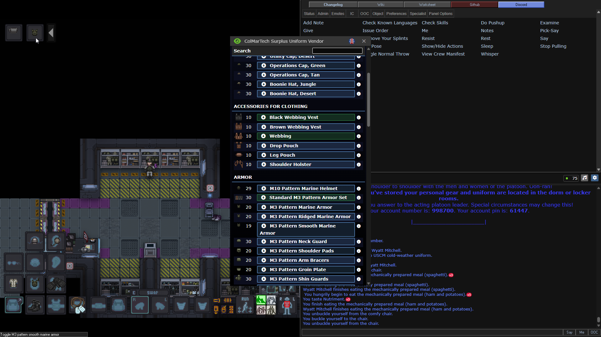
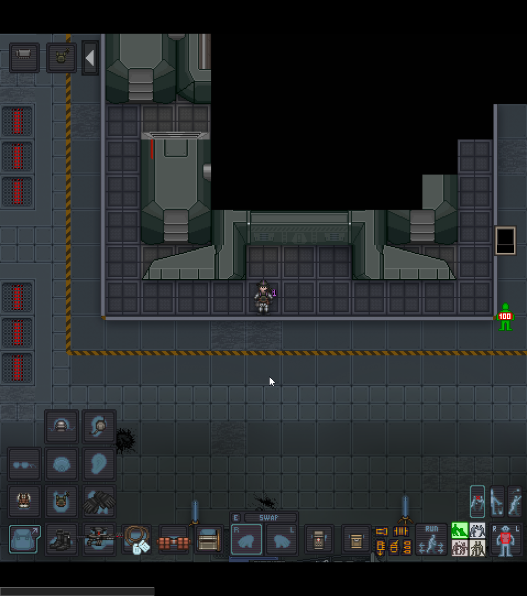
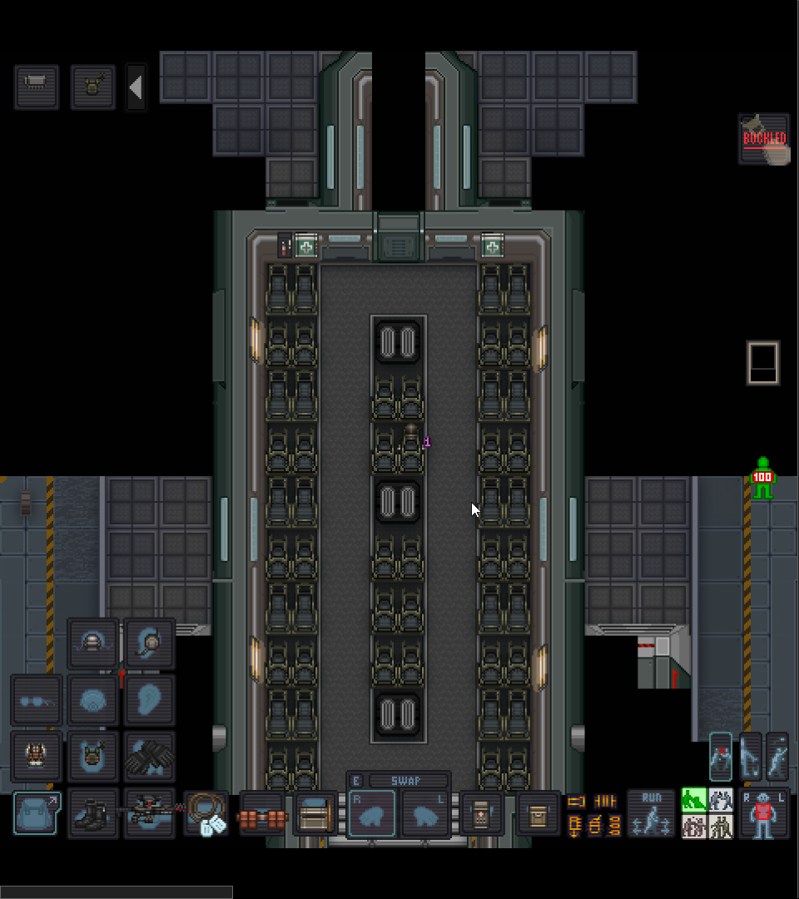

# Арсенал: Снаряжение и подготовка к бою

Брифинг окончен, двери арсенала открыты. Пора превратиться из новобранца в полноценную боевую единицу USCM.

*Помещение арсенала отряда "Чарли"*{: .caption }

---

## Броня и новый интерфейс
Первым делом подойдите к автомату с броней.

* **Экипировка:** Возьмите шлем и бронежилет (дополнительные элементы — это декор). Наденьте их в соответствующие слоты.
* **Панель управления снаряжением:** Как только вы наденете броню, **слева сверху** появится новый интерфейс. 
    * Здесь можно включать фонарик на броне, переключать визор шлема, раскладывать приклады, сошки или активировать подстволы.

## Подсумки и рюкзаки
Выберите способ переноски снаряжения:

* **Backpack (Рюкзак):** Вместительный, но открывается с небольшой задержкой.
* **Satchel (Сумка):** Меньше объемом, но открывается моментально.
* **Обвесы:** На саму броню можно нацепить подсумки для брони, на форму — жилет для мелочей, кобуру или ножную сумку. 
* **Карманы:** В слоты карманов можно нацепить подсумки (просто pouches). Это хранилища для расширения инвентаря.

!!! tip "Совет по снаряжению"
    Опытные бойцы часто вместо пистолета берут дополнительный жилет и забивают его медициной и сухпайками. Пистолет в реалиях боя используется крайне редко.

---

## Выбор и настройка оружия
Пройдите правее к автоматам с пушками. 

* **Рекомендация для новичка:** Выбирайте **М-39**. Это надежный ПП, на который можно поставить смарт-прицел.
* **Патроны:** Из этого же автомата можно взять обычные патроны к оружию, а из соседнего особые по типу бронепробиваемых, токсмичных и п
* **Обвесы (Attachments):** В автомате правее возьмите модули. Для М-39 идеально подойдут: **Smart Sight** (умный прицел — не дает стрелять по своим), **Recoil Compensator** (компенсатор отдачи) и передняя рукоятка или лазер.

#### Важные механики владения оружием:

* **Предохранитель:** Пушка из автомата уже заряжена! Чтобы не подстрелить товарища в лифте, зажмите **Alt + ЛКМ** на пушке в руке — появится надпись **Safety ON**. Не забудьте выключить её перед боем тем же сочетанием!
* **Хват:** При стрельбе с одной руки прицел сильно гуляет и вы сильно промахиваетесь. Нажмите **`Z`**, имея пушку в активной руке и свободную вторую руку — персонаж перехватит оружие двумя руками. 
* **Быстрый доступ:** Клавиша **`E`** (англ.) позволяет закинуть пушку за спину и быстро достать её обратно. Система умная: сначала достанет основное оружие, если его нет — пистолет, если и его нет — нож.
* **Нож:** Кликните **ЛКМ по своим сапогам** свободной рукой, **или же хоткей Ctrl + Е (англ.)**. В каждых десантных ботинках спрятан штык-нож.

---

## Амуниция и медицина
Вернитесь в арсенал, наденьте разгрузку для магазинов и пояс на ваш выбор. 

### Полевая аптечка:
В один из карманов положите **First Aid Pouch**. Если он пустой, возьмите рядом со шкафом брони:

* **Gause (Бинты):** От порезов и кровотечений.
* **Ointment (Мазь/Спрей):** От ожогов.
* **Splints (Шины):** При переломах конечностей.
* **Tramadol (Инъектор):** Обезболивающее, усиливает регенерацию и позволяет дольше стоять под огнем. Не переборщите!

!!! info "Как лечить"
    В зеленом интенте (**1**) кликните по себе или другу, чтобы осмотреть состояние. Если видите «перелом ноги» — выберите ногу на кукле, возьмите в руку шину (Splint) и кликните по пациенту. Тот же принцип для мазей и бинтов.

---

## Полезные мелочи

* **Флаеры (Сигнальные огни):** Положите их во второй карман. Клик по карману достанет флаер, нажатие **`Z`** активирует его и переведет вас в режим метания. Потренируйтесь на них, прежде чем кидать боевые гранаты!
* **Карта:** В каске есть слот — засуньте туда карту, чтобы не потеряться.
* **Еда:** Киньте в рюкзак пару **MRE** (сухпайков).
* **Инструменты:** Стоит иметь хотя бы одну **фомку (Crowbar)** на отряд для вскрытия дверей.

---

## Посадка и высадка
Когда закончите, идите направо к десантному кораблю (Dropship). 

*Точка построения у корабля*{: .caption }

* **Погрузка:** Помогите товарищам затащить ящики с припасами. Чтобы тащить ящик, подойдите в упор, и нажмите **Ctrl + ЛКМ** на ящик.
* **В полете:** Сядьте в кресло, иначе при старте и маневрах персонаж упадет и ударится. 

*Корабль внутри*{: .caption }

### Боевое развертывание:
По прилету отстегивайтесь и слушайте командира. Высадки бывают «жаркими». 

1. Возьмите оружие в обе руки (**`Z`**).
2. Проверьте предохранитель (**Alt + ЛКМ**).
3. Следите за линией огня: не стойте перед теми, у кого нет смарт-прицелов.
4. **Давайте инфу в чат, не гуляйте в одиночку (чтобы не стать закуской для ксеноморфа) и веселитесь!**