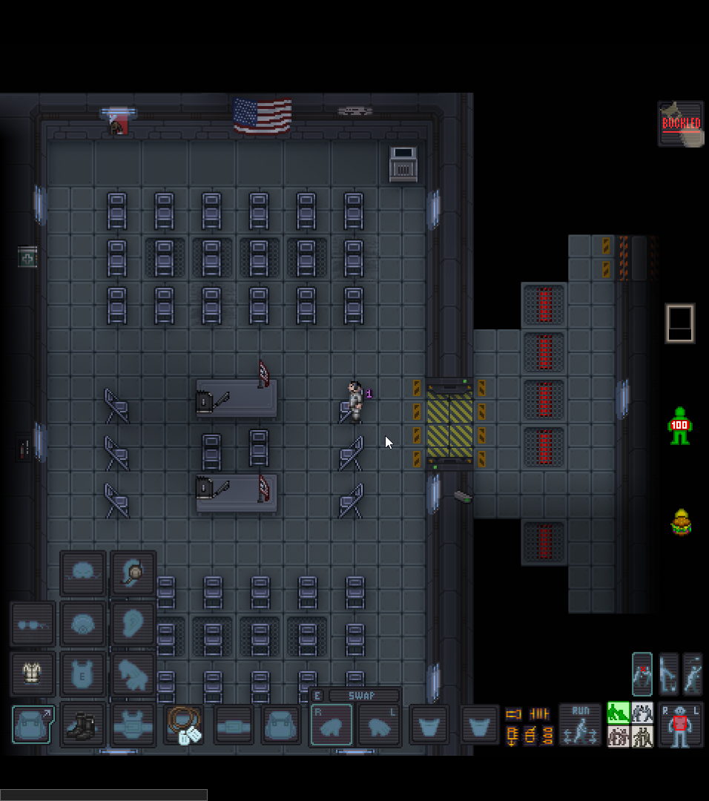

# Пробуждение: Первые шаги

Игра началась. Вы просыпаетесь в криокапсуле. Прежде чем бежать воевать, нужно привести себя в порядок.

---

## Определяем свой отряд
Первым делом посмотрите в чат. Во вступительном слове будет указан ваш отряд: **Альфа**, **Браво**, **Чарли** или **Дельта**. 

*Сообщение о назначении в роль и отряд*{: .caption }

!!! info "Цветовая индикация"
    Названия отрядов выделены цветом отряда. Будьте внимательны с **Дельтой** — она синяя, и этот текст можно случайно не заметить в чате.

Нажмите любую кнопку перемещения (**`W`, `A`, `S`, `D`**), чтобы встать из капсулы, и ищите на полу линии цвета вашего отряда.

---

## Сборы у шкафчика
Следуйте по линиям вправо к рядам шкафчиков. Если вы выбрали роль пехотинца, ваш шкафчик находится в **нижнем ряду**.

*Пехотинец "Чарли" снаряжается в секции отряда "Чарли"*{: .caption }

* **Как найти свой:** Наведите мышь на шкаф — слева снизу появится имя владельца. Если не уверены, нажмите **ПКМ** для вызова подробного меню.
* **Как открыть:** Кликните по шкафу (ЛКМ) — лампочка загорится зеленым. Второй клик откроет дверцу.

### Экипировка:
* **Взаимодействие:** Перетаскивайте вещи на персонажа с зажатой кнопкой мыши или кликайте по ним, чтобы взять в руку.
* **Смена рук:** Клавиша **`X`** (англ.) меняет активную руку (выделена рамкой на HUD).
* **Слоты:** Чтобы надеть вещь, возьмите её в руку и кликните по соответствующему слоту в инвентаре.

!!! danger "ВАЖНО: Связь"
    Обязательно наденьте **наушник** на ухо! Это критически важно: он позволяет общаться по рации и отображает маркеры союзников над их головами.

**Минимальный набор:** джампсьют (форма), ботинки и наушник. Жетоны можно прицепить на надетую форму, кликнув по ней жетонами в руке. Закрыть шкаф можно кликом свободной руки, а запереть — через меню на **ПКМ** по шкафчику.

---

## Кафетерий и обед
После криосна персонаж голоден — об этом напоминает значок гамбургера с красной стрелкой. Пройдите направо от шкафчиков в столовую.

*Помещение кафетерия*{: .caption }

1. **Вендомат:** Возьмите еду. Чтобы полностью насытиться, вам понадобится **две порции**.
2. **Как есть:** Можно перекусить на ходу (клавиша **`Z`** или клик по себе рукой с едой), но лучше присесть. Когда закончите с первым подносом, нажмите **`X`**, чтобы сменить активную руку на вторую, и приступайте к добавке.
3. **Как сесть:** Подойдите к стулу, зажмите **ЛКМ** на своем персонаже и перетащите его на стул. 
    * В углу появится статус **Blocked** (иконка ремня) — значит, вы сели на стул.
4. **Завершение:** Поев, кликните на стол рядом, чтобы оставить поднос, и нажмите на иконку **Blocked**, либо кнопку сопротивления (**Хоткей - `B`**), чтобы встать. 

---

## Брифинг и связь
Пройдите в комнату брифинга, чтобы послушать план операции и изучить карту.

!!! info "Как найти брифинг"
    От кафетерия пройдите в коридор **направо**, затем **вниз** до первых чёрных дверей со стеклом слева. Это и есть вход в комнату брифинга.

*Помещение брифинга*{: .caption }

### Памятка по связи и чату

Запомните основные клавиши для общения. Важно понимать разницу между игровыми (IC) и внеигровыми (OOC) чатами.

| Клавиша | Режим чата | Описание |
| :--- | :---: | :--- |
| **`T`** | **Local** | Сказать людям, стоящим рядом с вами. |
| **`Y`** | **Radio** | Связь по рации (слышит ваш отряд или взвод). |
| **`M`** | **Me** | Эмоции персонажа (например: *прищурился*, *салютует*). |
| **`O`** | **OOC** | Внеигровой чат на **весь сервер**. Для связи с админами или игроками. |
| **`L`** | **LOOC** | Локальный внеигровой чат (видят только те, кто рядом с вами). |

---

!!! info "Настройка рации и наушника"
    Нажав **Shift + ЛКМ** на наушник (когда он надет на вас), вы откроете меню управления.

    * **Каналы:** Здесь можно просмотреть список доступных каналов и переключаться между ними.
    * **Микрофон:** Вы можете полностью выключить рацию или включить микрофон. 
    * **Важно про микрофон:** Обычно он включен, но требует нажатия клавиши **T** и использования тэгов. Если переключить микрофон в режим "всегда активен", любое ваше сообщение в обычный чат (**T**) будет автоматически транслироваться в основной канал рации. Не рекомендую включать этот режим.

---

## Использование тэгов рации
Если вы пишете в обычный игровой чат (**T**), вы можете отправить сообщение в конкретный радиоканал, используя специальный код (тэг). После тэга обязательно ставьте пробел!

* **Как это работает:** `:тэг Сообщение`
* **Пример:** `:g Привет всем!` — ваше сообщение уйдет в публичный канал корабля.
* **Кириллица:** Система понимает и русские буквы (например, `:п Привет всем!`).

## Путь в Арсенал
После брифинга идите по цветовым индикаторам вверх и вправо к арсеналу вашего отряда. Как только Командир Взвода (Platoon Commander) откроет двери — начнется самое интересное.

!!! success "Следующий этап"
    Вы готовы к снаряжению. Переходим к финальной части подготовки — **[Арсеналу](armoury.md)**.