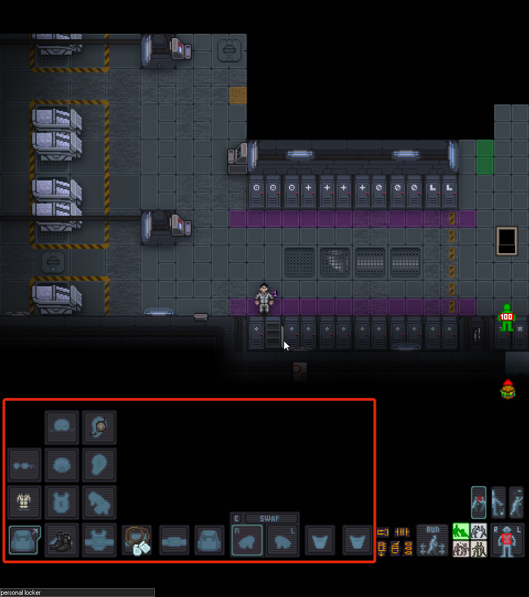
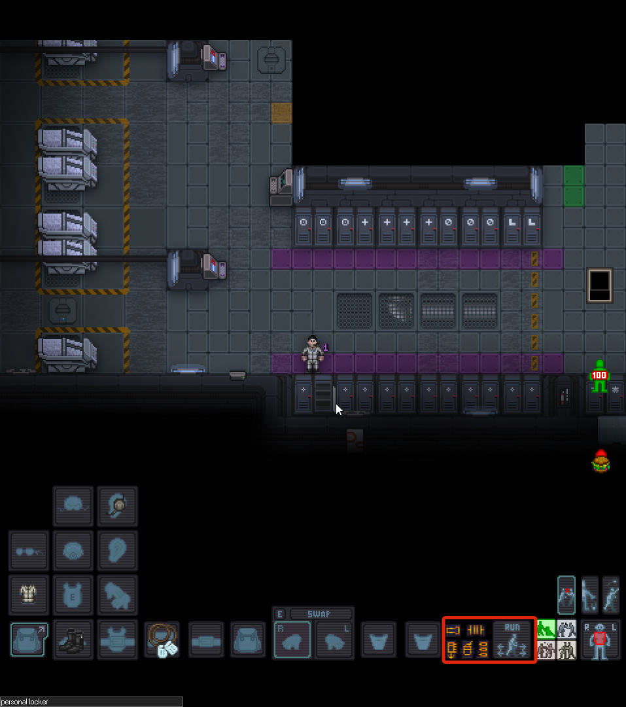
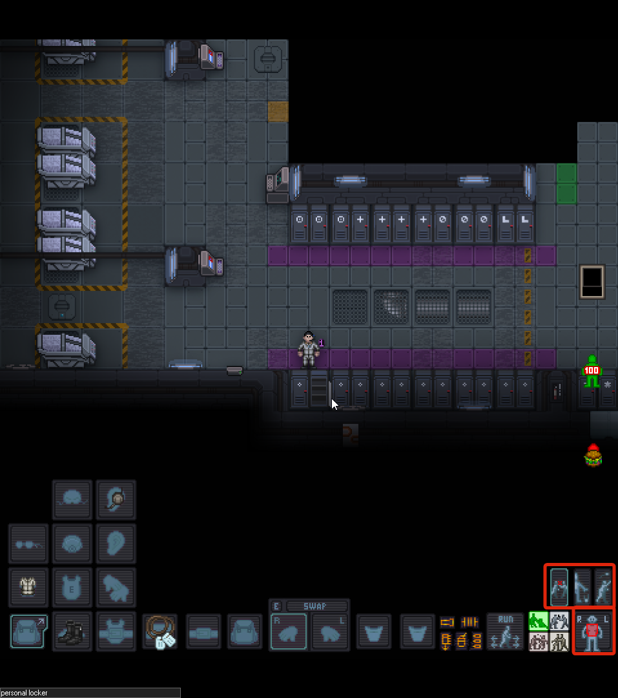
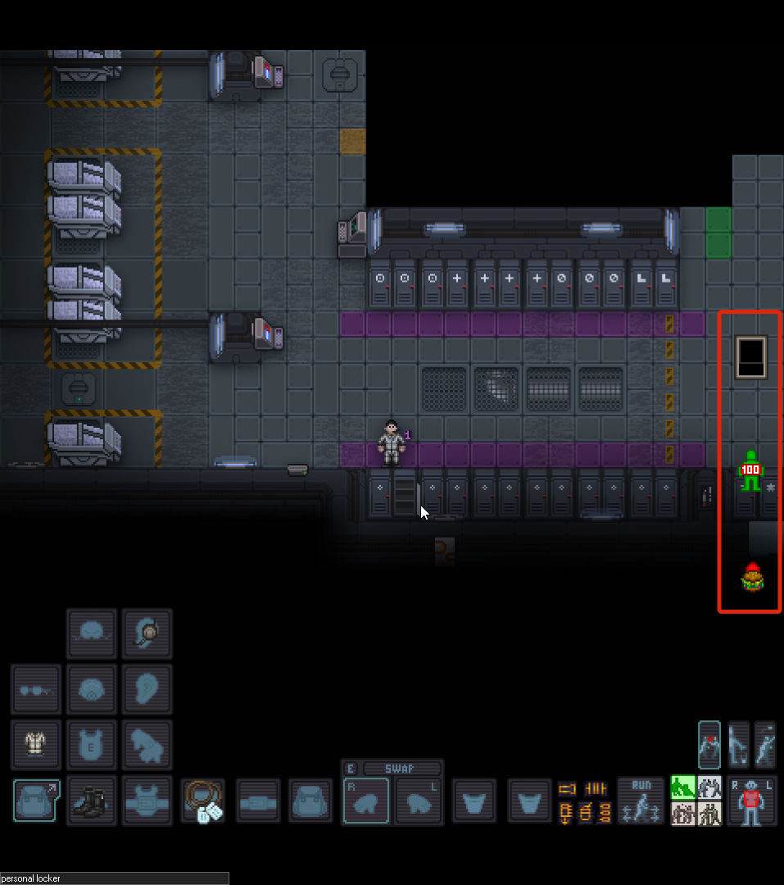

# Интерфейс и управление

Игра начинается! Вы просыпаетесь в криокапсуле (или просто «крио») после длительного сна. Прежде чем бежать в арсенал, давайте разберемся, что вы видите на экране.

*Пробуждение в крио*{: .caption }

---

## Общий вид
Теперь перейдём к интерфейсу игровой половины экрана.

*Основные элементы управления*{: .caption }

Экран разделен на две основные части:

1.  **Левая часть (Игровое поле):** Здесь происходит основной экшен.
    * *Ориентирование:* Север — **сверху**, Юг — **снизу**, Запад — **слева**, Восток — **справа**.
2.  **Правая часть (Информационная):**
    * **Сверху:** Вспомогательные меню (Персонаж, Связь с администрацией, Эмоуты).
    * **Снизу:** Окно чата и лог событий.

!!! tip "Погружение"
    Используйте меню эмоутов (справа сверху) для более вариативного отыгрыша.

---

## Панель снаряжения (Слева снизу)
Здесь отображается всё, что надето на вашего бойца.

* **Рюкзак:** Если вы видите одинокую иконку рюкзака — нажмите на неё, чтобы развернуть полную сетку слотов снаряжения.
* **Слоты:** Здесь находятся ваши жетоны (ID), пояс, спина (рюкзак), карманы и две руки.
* **Активная рука:** Выделена рамкой. Именно этой рукой вы будете взаимодействовать с предметами.

*Развернутое меню снаряжения*{: .caption }

---

## Взаимодействие с оружием (Справа снизу)
Желтое меню отвечает за работу с вашим стволом. Запомните: **автоперезарядки в игре нет!**

* **Фонарик:** Включить/выключить (если установлен на пушке).
* **Извлечь магазин:** Вытащить текущий магазин из оружия (прямоугольник со стрелкой вниз).
* **Режим огня:** Переключение между режимами (три пули). Обычно это «Очередь» или «Одиночные». Пушки редко поддерживают полный автомат.
* **Скорость:** Переключение между бегом и шагом. 99% времени вы будете бегать.

*Кнопки взаимодействия с оружием*{: .caption }

---

## Системы взаимодействия (Интенты)
Четыре кнопки с человечками — это ваш метод взаимодействия с миром. Выбираются клавишами **1, 2, 3, 4** (верхний ряд клавиатуры, НЕ нумпад!).

| Режим (Интент) | Назначение | Особенности |
| :--- | :--- | :--- |
| **1. Зеленый (Помощь)** | Помощь себе и союзникам. | Самый частый интент. Позволяет осматривать других и пропускать союзников сквозь себя (swap). Не стойте в нем в первом ряду — враги тоже могут пройти! |
| **2. Синий (Разоружение)** | Попытка забрать оружие. | Бесполезен против ксеноморфов (лапы не оторвать). Позволяет забрать ствол у противника в ближнем бою. |
| **3. Желтый (Захват)** | Хватать и тащить. | Незаменим для эвакуации раненых друзей и работы со стационарными орудиями. Безопасен для своих. |
| **4. Красный (Агрессия)** | Боевой режим. | В этом режиме вы наносите урон. **Осторожно:** если не отключено в настройках, можно начать избивать самого себя! |

*Кнопки интентов*{: .caption }

---

## Выбор цели и манипуляции
* **Кукла (Target Doll):** Управляется цифровым блоком клавиатуры (**Numpad**). Позволяет выбрать часть тела для стрельбы или лечения. Чаще всего выбирают грудь или голову.
* **Действия с предметами (Три кнопки выше куклы):**
    * **Сопротивляться (Resist):** Вырваться из захвата, встать со стула, потушиться если горишь (**Хоткей - B**).
    * **Бросить (Drop):** Положить предмет из активной руки на землю (**Хоткей - Q**).
    * **Метание (Throw):** Встать в позу для броска (например, для гранаты) (**Хоткей - R**).

*Кукла и дополнительные действия*{: .caption }

---

## Состояние персонажа (Справа посередине)
* **Планшет (Squad Tablet):** Список вашего отряда, их распределение по огневым группам и текущие роли. 
    * **Функция компаса:** Помимо списка, сам значок планшета на экране показывает направление к вашему лидеру или ключевой точке. Он может указывать на: **Штаб-сержанта** (Section Sergeant), **Сержанта огневой группы** (Squad Leader), **Командира взвода** или **Точку высадки (LZ)**.
    * **Как переключать:** Нажмите **Alt + ЛКМ** на иконку планшета, чтобы сменить цель, на которую он указывает.
    
!!! warning "Почему иконка пустая?"
    Если планшет не показывает стрелку и выглядит «пустым», значит цель не найдена. Это происходит, если:
    
    1. В вашей огневой группе нет лидера (Fireteam Sergeant).
    2. Вы сами не назначены ни в одну огневую группу.
    3. Роли Штаб-сержанта или Командира взвода вакантны (никто их не занял).
    4. Точка высадки еще не установлена.

* **Индикатор боли (Pain Indicator):** Зеленый человечек с числом «100». Это не полоска здоровья в привычном понимании, а датчик того, насколько вашему персонажу сейчас **больно**.
    * **100 (Зеленый):** Вы не чувствуете боли, персонаж в полном порядке.
    * **Динамика боли:** При ранениях цвет индикатора меняться. Если боль станет слишком сильной, персонаж может впасть в болевой шок и потерять сознание.
    * **Онемение и анестезия:** Если вы приняли сильные обезболивающие, индикатор может измениться, показывая, что вы перестали чувствовать конечность или всё тело (онемение). Это может быть опасно: вы не заметите, как истекаете кровью, потому что вам «не больно».

!!! danger "Жизнь и смерть"
    Пока индикатор не стал серым с надписью **Dead** — вы живы! Даже если если у вас остановилось сердце, медики могут вас спасти. Но помните: если вам оторвало голову или сожгло дотла — реанимация не поможет.

* **Голод:** Находится под индикатором здоровья. После крио вы будете голодны — это влияет на выносливость, так что не забудьте перекусить после пробуждения и перед вылетом.

*Состояние персонажа*{: .caption }