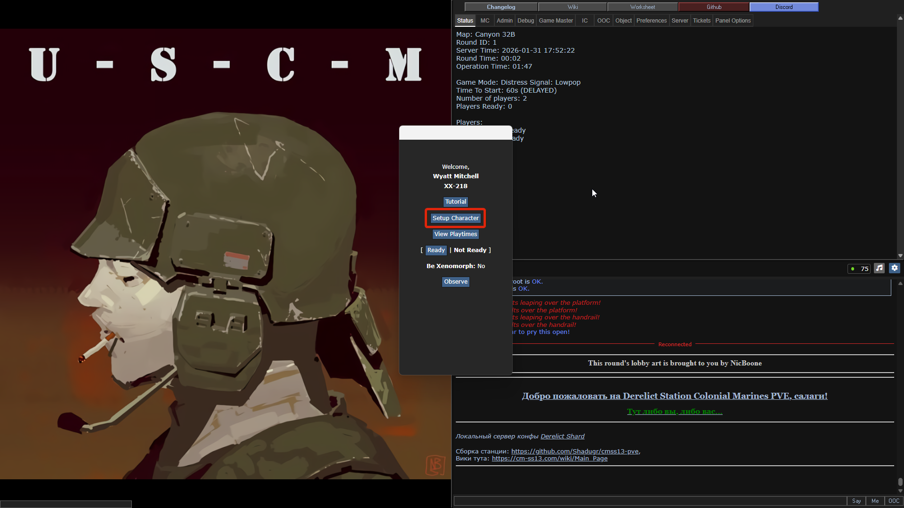
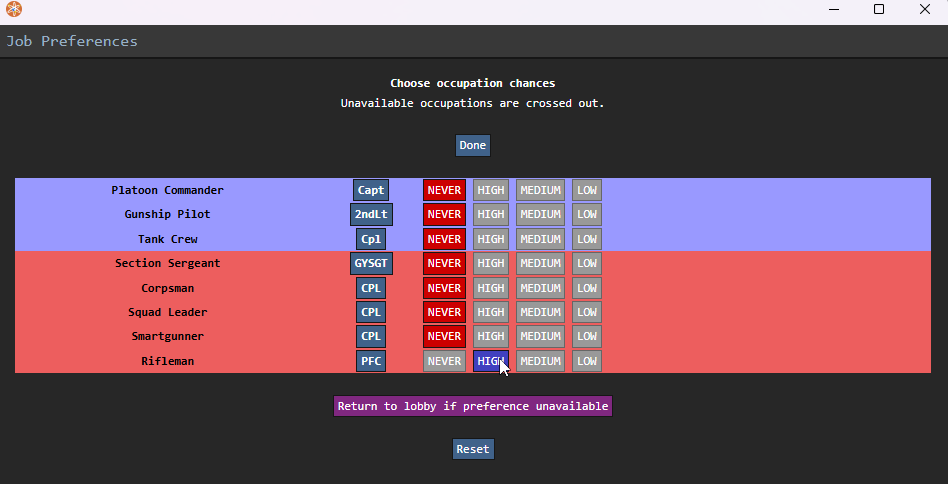
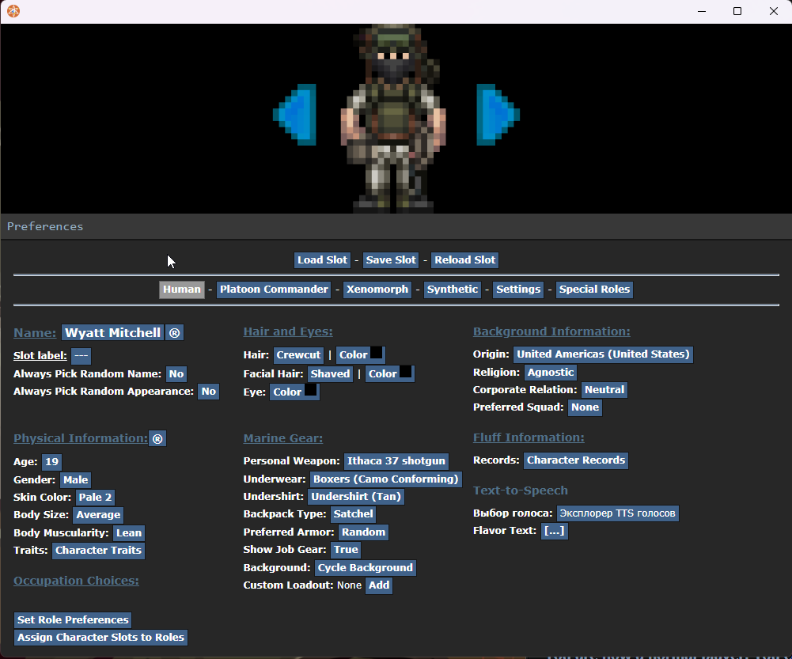

# Создание персонажа и выбор роли

После того как вы зашли на сервер (подробнее в разделе [Как подключиться?](server_enter.md)), перед вами откроется главное меню. Здесь начинается ваш путь в рядах USCM.

---

## Первое появление
Если вы зашли впервые, вам нужно создать своего бойца. Нажмите кнопку **Create New Character** в главном меню.

*Начните здесь, чтобы создать своего морпеха*{: .caption }

## Выбор специализации (Roles)
Первым делом выберем вашу роль. Нажмите на пункт **Set Preference Role**.

*Выбор роли*{: .caption }

!!! success "Совет для новичков"
    Для первого вылета мы настоятельно рекомендуем роль **Пехотинца (Rifleman)**. Это универсальный боец с огромным выбором оружия и минимумом сложной ответственности. Идеально, чтобы осмотреться и не подвести команду.

### Обзор доступных ролей

Перед выбором роли оцените свои силы. 
* **Сложность** — сколько нужно знать (механики, кнопки, правила).
* **Интенсивность** — насколько быстро придется действовать и как много событий будет вокруг.

| Роль | Задачи в бою | Сложность | Интенсивность |
| :--- | :--- | :---: | :---: |
| **Командир взвода** | Стратегия, брифинги и запросы снабжения с корабля. Сложность и интенсивность резко сменяются на высокие, если командир высаживается на землю. | **Низкая** | **Низкая** |
| **Пилот** | Десантирование, авиаподдержка (CAS) и эвакуация. | **Средняя** | **Низкая** |
| **Экипаж техники** | Управление и ремонт танков, БТР и БМП. | **Средняя** | **Средняя** |
| **Штаб-сержант (Section Sergeant)** | **Командир отряда (9 чел)**. Полевой лидер и координатор. | **Высокая** | **Высокая** |
| **Сержант огн. группы (Squad Leader)** | **Лидер «четверки»**. Командует своей огневой группой. | **Средняя** | **Низкая-Высокая** |
| **Медик (Corpsman)** | Полевая хирургия, реанимация и спасение жизней. | **Высокая** | **Огромная!** |
| **Смартганнер** | Подавление врага огнем «умного» пулемета. | **Средняя** | **Высокая** |
| **Пехотинец (Rifleman)** | Универсальный боец. Основа огневой мощи. | **Низкая** | **Низкая-Высокая** |

#### Иерархия сержантов
Чтобы не путаться в рации и понимать, кто ваш непосредственный начальник:

* **Штаб-сержант (Section Sergeant):** Главный на земле. Он видит картину боя целиком и командует всем отрядом.
* **Сержант огневой группы (Squad Leader):** Помощник штаб-сержанта. Командует своей «четверкой» бойцов для выполнения локальных задач (штурм здания, удержание прохода).

---

## Настройка внешности и перков
Теперь настроим детали вашего бойца. В меню настройки вы найдете пункты: **Appearance** (внешность), **Background information** (биография), **TTS Voice** (голос) и **Perks** (перки).

*Настройте внешку и выберите кастомное снаряжение*{: .caption }

* **Кастомная выкладка:** Здесь можно выбрать приятные мелочи (вроде любимой зажигалки). Основную броню и пушку вы получите уже в арсенале на старте.
* **Перки:** Это ваши пассивные бонусы.

!!! warning "Медицинский совет по перкам"
    **Не берите «Устойчивость к химикатам»!** Если вы получите тяжелое ранение, медикам придется вливать в вас литры лекарств. С этим перком ваш организм будет сопротивляться лечению, и вы просто умрете на операционном столе, потратив ресурсы, которых хватило бы на пятерых.

!!! tip "Выбор редакции: «Стальная челюсть»"
    Этот перк не дает вам выронить предмет изо рта (например, сигарету), когда вас сбивают с ног. Не позволяйте ксеносам мешать вам докуривать ваш Lucky Strike!

---

## Завершение
После того как всё настроено:

1. Нажмите кнопку **Save Setup**, чтобы сохранить персонажа.
2. Закройте редактор.
3. Нажмите кнопку **Declare Ready** (Готовность) в главном меню.

**Увидимся в десантном отсеке, морпех!**