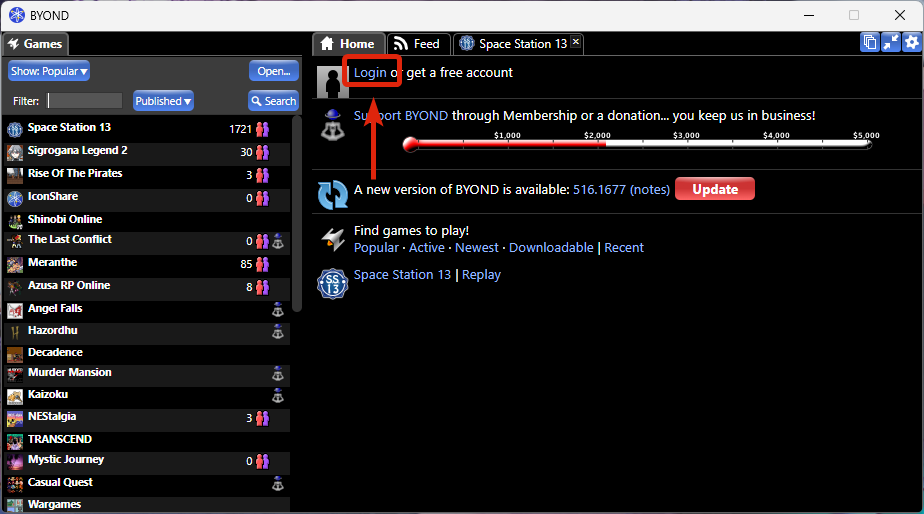

# Как зайти на сервер

## Подключение к игре

Для игры на нашем сервере тебе понадобятся две вещи: **RadminVPN** (для имитации локальной сети) и клиент **BYOND**.

### Настройка RadminVPN

1. Скачайте и установите программу с [официального сайта](https://www.radmin-vpn.com/).
2. Запустите её и выберите: **Сеть** → **Присоединиться к сети**.
3. Введите данные для входа:
    * **Имя сети:** `DFка`
    * **Пароль:** `000000`
4. Нажмите кнопку **Подключиться**.

---

### Вход на сервер

1. Скачайте клиент **BYOND** по [ссылке](https://www.byond.com/download/).
2. Установите его, а затем обязательно **полностью закройте** (проверьте системный трей возле часов) и запустите снова.
3. Если у вас нет аккаунта, [зарегистрируйтесь здесь](https://secure.byond.com/Join).
4. **Логинимся:** Нажмите кнопку логина в правой части клиента.

*Кнопка входа в клиенте*{: .caption }

5. **Заходим на сервер:** Нажмите кнопку **Open**, вставьте адрес сервера или выберите его из закладок.

*Окно ввода адреса сервера*{: .caption }
---

## Информация о сервере

!!! success "Адрес для подключения"
    **IP сервера:** `byond://26.174.60.22:7777`  
    *(Скопируйте и вставьте в BYOND: Open → URL)*

## Проведение игр и график

На сервере принята **ивентовая система** проведения сессий. Это значит, что игры организуются по мере возможности, а фиксированного ежедневного расписания нет. 

Если на конкретный день назначен ивент, то ориентируйтесь на следующее время начала:

| Тип дня | Примерное время (МСК) |
| :--- | :---: |
| **Будни** | 20:00 |
| **Выходные** | 18:00 |

!!! info "Где следить за сборами?"
    Точная дата и время каждого ивента публикуются заранее. Чтобы не пропустить игру, обязательно заглядывайте в канал **`#cm-инфо`** в нашем Discord!