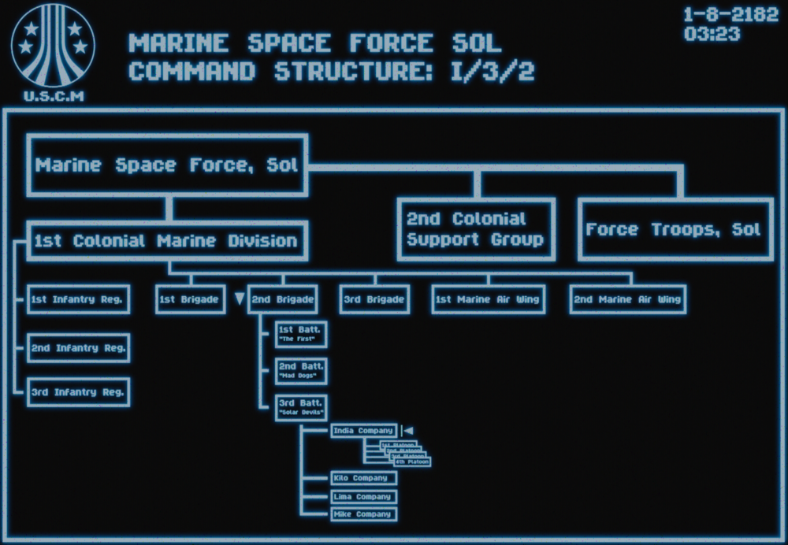

# Лор и структура

На дворе **2182 год**. Человечество продолжает экспансию в глубокий космос, а порядок в колониях обеспечивается сталью и кровью морской пехоты.

---

## 3-й батальон «Солнечные дьяволы»
**3/2 (3rd Battalion, 2nd Brigade)** — одно из ключевых подразделений Колониальной морской пехоты (USCM). 

* **Базирование:** Кэмп-Пендлтон, Калифорния, Земля. 
* **Статус:** Действующее подразделение Объединенных Америк (ОА).
* **Боевой путь:** Батальон прошел через 5 крупных кампаний. 
    * Две из них закончились блестящей победой.
    * Одна прошла без особых отличий.
    * В двух последних батальон оказался на грани полного уничтожения, но выстоял.

### Состав батальона
Батальон разделен на четыре роты:
1. **Рота «Индия» (I)** — наша основная пехотная рота.
2. **Рота «Кило» (K)** — пехота.
3. **Рота «Лима» (L)** — пехота.
4. **Рота поддержки** — логистика, снабжение и транспорт.

---

## Взвод «Солнечные всадники»
Мы — **1-е отделение взвода «Солнечные всадники»**, входящее в состав роты «Индия». 

!!! info "Особенности механики"
    На нашем сервере структура и снаряжение оптимизированы для игрового баланса и могут отличаться от классических фильмов или других PVE/PVP сборок.

### Командный и вспомогательный состав
За логистику и общую координацию отвечает **Командир отделения** и подчиняющиеся ему специалисты поддержки:

| Специализация | Задачи и возможности |
| :--- | :--- |
| **Экипаж корабля (Пилот)** | Доставка десанта, медицинская эвакуация «на лету», десантирование бойцов с парашютом и огневая поддержка с воздуха (CAS). |
| **Экипаж бронетехники** | Управление и обслуживание бронемашин. Доступная техника: **Танки**, **БТР** и **БМП**. |

---

### Структура пехотных групп
Наше отделение разделено на 4 оперативных отряда: **Альфа**, **Браво**, **Чарли** и **Дельта**. 

#### Состав отряда (9 человек)
Каждый отряд — это автономная боевая единица, состоящая из двух огневых групп:

| Роль | Кол-во | Обязанности |
| :--- | :---: | :--- |
| **Штаб-сержант** | 1 | Командование отрядом |
| **Сержант огневой группы** | 2 | Лидеры «четверок» |
| **Медик** | 1 | Полевая медицина |
| **Смартганнер** | 1 | Тяжелая огневая мощь |
| **Пехотинец** | 4 | Основная ударная сила |

#### Огневая группа (Fireteam)
Для мобильности отряд делится на две группы:
* **Состав:** 2 пехотинца + 1 специалист (Медик или Смартганнер) + 1 Сержант огневой группы.

---

### Иерархия USCM
<figure style="display: block; width: 80%; margin: 20px auto; text-align: center;">
  
  <figcaption style="margin-top: 10px; color: grey; font-style: italic;">Архивная запись: Структура иерархии USCM</figcaption>
</figure>